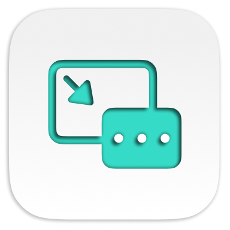

<div align="center">



# PiPOSS

> Abbreviation for "Picture in Picture Open Source Software"

Brings Picture in Picture shortcut and custom button to any video.

</div>

## Install

### Via [Homebrew Cask](//brew.sh) (Recommended)

```ps1
brew install --cask --no-quarantine artginzburg/tap/piposs
```

> Check out [the cask][cask] if you're interested.

### Direct Download

**[Latest Release ](//github.com/artginzburg/PiPOSS/releases/latest/download/PiPOSS.zip)**

---

## Usage

Run the app, enable the PiPOSS extension in Safari, and give it access if it requests anything.

Now you'll be able to use <kbd>P</kbd> on your keyboard to toggle Picture in Picture mode for currently playing or the first appearing video on the page.

> Also, YouTube will have a button for Picture in Picture.

### Tips

If macOS refuses to run the app, run it via <kbd>Ctrl</kbd>+<kbd>Click</kbd> > `Open`.

[cask]: https://github.com/artginzburg/homebrew-tap/blob/main/Casks/piposs.rb
